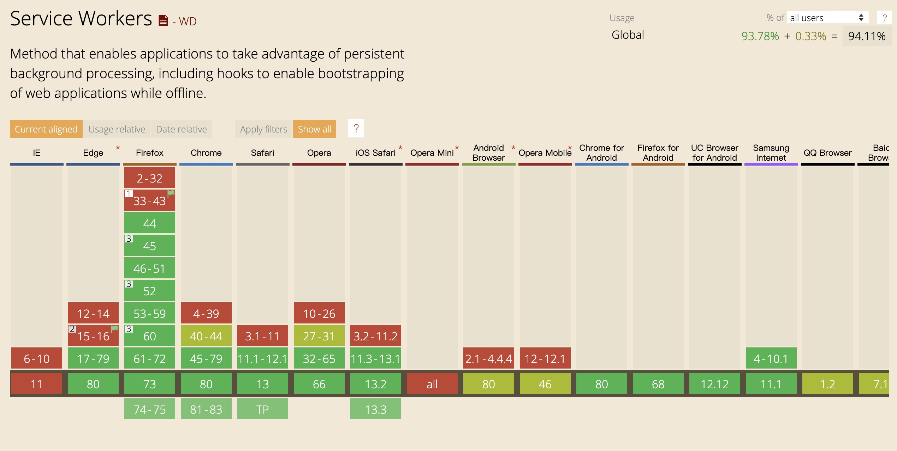
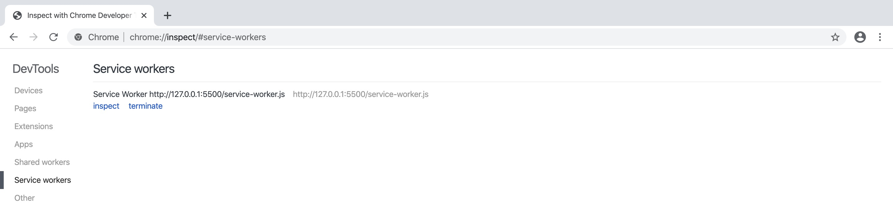
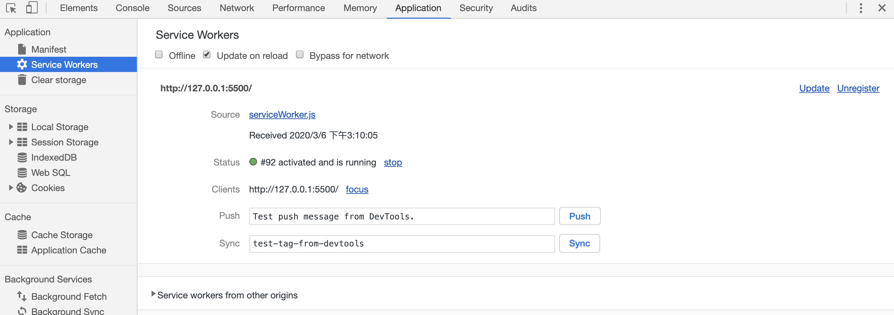

# 一、概述

Service Worker 是 Chrome 团队提出和力推的一个 WEB API，用于给 web 应用提供高级的可持续的后台处理能力。Service Worker 是浏览器在后台独立于网页运行的脚本，它打开了通向不需要网页或用户交互的功能的大门。 现在，它们已包括如[推送通知](https://developers.google.cn/web/updates/2015/03/push-notifications-on-the-open-web)和[后台同步](https://developers.google.cn/web/updates/2015/12/background-sync)等功能。 将来，Service Worker 将会支持如定期同步或地理围栏等其他功能。

在 Service Worker 出现前，存在能够在网络上为用户提供离线体验的另一个 API，称为 [AppCache](https://www.html5rocks.com/en/tutorials/appcache/beginner/)。 AppCache API 存在的许多相关问题，在设计 Service Worker 时已予以避免。

作为一个比较新的技术，大家可以把 Service Worker 理解为一个介于客户端和服务器之间的一个代理服务器。在 Service Worker 中我们可以做很多事情，比如拦截客户端的请求、向客户端发送消息、向服务器发起请求等等，其中最重要的作用之一就是离线资源缓存。



完整教程：[https://lzw.me/a/pwa-service-worker.html](https://lzw.me/a/pwa-service-worker.html)

**特点**

- 无法直接访问 DOM。 Service Worker 通过响应 [postMessage](https://html.spec.whatwg.org/multipage/workers.html#dom-worker-postmessage) 接口发送的消息来与其控制的页面通信，页面可在必要时对 DOM 执行操作
- 只能使用HTTPS以及localhost
- 可以拦截全站请求从而控制你的应用
- 与主线程独立不会被阻塞（不要再应用加载时注册sw）
- 完全异步，无法使用XHR和localStorage
- 一旦被 install，就永远存在，除非被 uninstall或者dev模式手动删除
- 独立上下文
- 响应推送
- 后台同步

# 二、现状

说起service worker就不得不提起PWA了，service worker做为PWA的核心技术之一，多年来一直被Google大力推广，这里简单介绍一下。

通俗来说，PWA就是渐进式web应用(Progressive Web App)。早在16年初，Google便提出PWA，希望提供更强大的web体验，引导开发者回归开放互联网。它弥补了web对比Native App急缺的几个能力，比如离线使用、后台加载、添加到主屏和消息推送等，同时它还具备了小程序标榜的“无需安装、用完即走”的特性。

虽然PWA技术已经被W3C列为标准，但是其落地情况一直以来是很让人失望的，始终受到苹果的阻碍，最重要的原因在于PWA绕过Apple Store审核，直接推给用户。如果普及，这将威胁到苹果的平台权威，也就意味着苹果与开发者的三七分成生意将会落空。

所以一直以来safrai不支持mainfest以及service worker这两项关键技术，即使在18年开始支持了，但是对PWA的支持力度也远远低于安卓，具体体现在service worker缓存无法永久保存，以及service worker的API支持不够完善，一个最明显的不同在于安卓版本的PWA会保留你的登录状态，并且会系统级推送消息。而在苹果上，这两点都做不到。也就是说，iPhone上的微博PWA，每次打开都要重新登录，而且不会收到任何推送信息。

另外由于某些不可描述的原因，在国内无法使用Service Worker的推送功能，虽然国内已经有两家公司做了service worker的浏览器推送，但是成熟度还有待调研。

由于目前各版本手机浏览器对service worker的支持度都不太相同，同一个接口也存在差异化还有待统一，之于我们来说，也只能用Service Worker做一做PC浏览器的缓存了。

> 摘自：https://www.jianshu.com/p/768be2733872

# 三、PWA

谷歌给以 Service Worker API 为核心实现的 web 应用取了个高大上的名字：Progressive Web Apps（PWA，渐进式增强 WEB 应用），并且在其主要产品上进行了深入的实践。那么，符合 PWA 的应用特点是什么？以下为来自谷歌工程师的解答。

Progressive Web Apps 是:

- **渐进增强** – 能够让每一位用户使用，无论用户使用什么浏览器，因为它是始终以渐进增强为原则。
- **响应式用户界面** – 适应任何环境：桌面电脑，智能手机，笔记本电脑，或者其他设备。
- **不依赖网络连接** – 通过 Service Workers 可以在离线或者网速极差的环境下工作。
- **类原生应用** – 有像原生应用般的交互和导航给用户原生应用般的体验，因为它是建立在 app shell model 上的。
- **持续更新** – 受益于 Service Worker 的更新进程，应用能够始终保持更新。
- **安全** – 通过 HTTPS 来提供服务来防止网络窥探，保证内容不被篡改。
- **可发现** – 得益于 W3C manifests 元数据和 Service Worker 的登记，让搜索引擎能够找到 web 应用。
- **再次访问** – 通过消息推送等特性让用户再次访问变得容易。
- **可安装** – 允许用户保留对他们有用的应用在主屏幕上，不需要通过应用商店。
- **可连接性** – 通过 URL 可以轻松分享应用，不用复杂的安装即可运行。

# 三、生命周期

[查看大图 >>](https://img.meituan.net/csc/79cb108567a81104d682418b51506d201150343.png)

Service Worker 的生命周期完全独立于网页。

使用 Service Worker 大概需要如下几个过程（生命周期）

1. 注册：在JavaScript中调用register方法进行注册

2. 安装：开始安装--->安装中---->安装完成：缓存某态资源

3. 激活：开始激活--->激活中---->激活完成：管理旧缓存

4. 废弃：安装失败或激活失败或被新版的Service Worker替代都会进入废弃状态

当激活后，我们更多的时候就是在监听网络请求：fetch

Service Worker 脚本最常用的功能是截获请求和缓存资源文件, 这些行为可以绑定在下面这些事件上：

- install 事件中, 抓取资源进行缓存

- activate 事件中, 遍历缓存, 清除过期的资源

- fetch 事件中, 

谷歌基础示例 >>：https://github.com/GoogleChrome/samples/tree/gh-pages/service-worker/basic

# 四、基本使用

## 1. 注册

```js
// /js/index.js
if ('serviceWorker' in navigator) {
    window.addEventListener('load',  () => {
        navigator.serviceWorker.register('/service-worker.js', {scope: '/'}).then(reg => {
            console.log("success：", reg);
        }).catch(err => {
            console.log("fail：", err);
        });
    });
};
```
register 方法参数解读：

- 第1个参数：service worker 文件的路径，这个文件路径是相对于 Origin ，而不是当前 JS 文件的目录的
- 第2个参数：配置项，可选，其中比较重要的是 scope 属性，指定其起作用的范围

> 注意：
>
> 1. Service Worker 的注册路径决定了其 scope 默认作用范围。示例中 serviceWorker.js 是在 / 路径下，这使得该 Service Worker 默认只会收到 / 路径下的 fetch 事件。
> 2. 如果存放在网站的 /test 下，则将会收到该网站 /test 路径下的所有 fetch 事件。
> 3. 如果希望改变它的作用域，可在第二个参数设置 scope 范围。示例中将其改为了根目录，即不管serviceWorker.js 文件在哪个路径，都会对整个站点生效。
> 4. 另外应意识到这一点：Service Worker 没有页面作用域的概念，作用域范围内的所有页面请求都会被当前激活的 Service Worker 所监控。

**# 查看 Service Worker 信息（检测是否启用）**

1. 第一种：注册成功之后，在谷歌浏览器中，输入：`chrome://serviceworker-internals` 即可查看

   

   首次注册 Service Worker 时，还可以通过 `chrome://serviceworker-internals` 来查看 Service Worker 详情。 如果只是想了解 Service Worker 的生命周期，这仍很有用，但是日后其很有可能被 `chrome://inspect/#service-workers` 完全取代。

2. 第二种：在application中查看serviceworker信息


> 提示：
>
> 1. 在默认情况下，Service Worker 必定会**每24小时**被下载一次，如果下载的文件是最新文件，那么它就会被重新注册和安装，但不会被激活，当不再有页面使用旧的 Service Worker 的时候，它就会被激活。这对于我们开发来说是很不方便的，因此在这里我勾选了一个名为 **Update on reload** 的单选框，选中它之后，我们每次刷新页面都能够使用最新的 service worker 文件
> 2. 在同一个 Origin 下，我们可以注册多个 Service Worker。但是请注意，这些 Service Worker 所使用的 **scope 必须是不相同的**

但是仅仅是这样就够了吗？只有注册，那么发生问题的时候怎么注销sw呢？注销以后缓存如何处理？这些是要提前考虑好的，一个考虑了出错降级的简易注册demo：		

```js
window.addEventListener('load', function () {
    const sw = window.navigator.serviceWorker
    const killSW = window.killSW || false
    if (!sw) {
        return
    }
    if (!!killSW) {
        sw.getRegistration('/serviceWorker').then(registration => {
            // 手动注销
            registration.unregister();
            // 清除缓存
            window.caches && caches.keys && caches.keys().then(function (keys) {
                keys.forEach(function (key) {
                    caches.delete(key);
                });
            });
        })
    } else {
        // 表示该 sw 监听的是根域名下的请求
        sw.register('/service-worker.js', { scope: '/' }).then(registration => {
            // 注册成功后会进入回调
            console.log('Registered events at scope: ', registration.scope);
        }).catch(err => {
            console.error(err)
        })
    }
});
```

## 2. 安装

注册完 Service Worker 之后，浏览器会为我们自动安装它，需要为安装事件定义回调，并决定想要缓存的文件。在 `install` 回调的内部，我们需要执行以下步骤：

1. 打开缓存。
2. 缓存文件。
3. 确认所有需要的资产是否已缓存。

```js
// /service-worker.js
// => 安装
// 用于标注创建的缓存，也可以根据它来建立版本规范
const CACHE_NAME = "cache_v1.0.0";
// 列举要默认缓存的静态资源，一般用于离线使用
const urlsToCache = [
    '/',
    '/js/index.js',
    '/css/index.css',
    '/images/jayChou.jpeg'
];
self.addEventListener('install', event => {
    event.waitUntil(
        caches.open(CACHE_NAME).then(cache => {
            return cache.addAll(urlsToCache);
        })
    );
})
```

> 提示：缓存文件的列表通常来说我们应当使用webpack的插件或者其他工具在构建的时候自动生成。缓存的版本号也应当独立出来修改，这里我们将每一次的构建视作一个新的版本。

## 3. fetch（缓存和返回请求）

当激活完毕后就可以在fetch事件中对站点作用范围下的所有请求进行拦截处理了，你可以在这个阶段灵活的使用indexDB以及caches等api制定你的缓存规则。

```js
// => fetch
// 发起请求时去根据uri去匹配缓存，无法命中缓存则发起请求，并且缓存请求
self.addEventListener('fetch', event => {
    event.respondWith(
        // 先去缓存中查找请求的文件
        caches.match(event.request).then(response => {
            // 如果找到了就返回缓存文件
            if (response) {
                return response;
            }
            // 如果没有找到则发起请求
            // 克隆请求
            const fetchRequest = event.request.clone();
            return fetch(fetchRequest).then(response => {
                // 请求成功之后将新的资源存入缓存中，然后再返回下载的资源
                if (!response || response.status !== 200 || response.type !== 'basic') {
                    return response;
                }
                const responseToCache = response.clone();
                caches.open(CACHE_NAME).then(cache => {
                    cache.put(event.request, responseToCache);
                });
                return response;
            });
        })
    );
});
```

执行的操作如下：

1. 在 `fetch` 请求中添加对 `.then()` 的回调。
2. 获得响应后，执行以下检查：
   1. 确保响应有效。
   2. 检查并确保响应的状态为 `200`。
   3. 确保响应类型为 **basic**，亦即由自身发起的请求。 这意味着，对第三方资产的请求也不会添加到缓存。
3. 如果通过检查，则[克隆](https://fetch.spec.whatwg.org/#dom-response-clone)响应。 这样做的原因在于，该响应是[数据流](https://streams.spec.whatwg.org/)， 因此主体只能使用一次。 由于我们想要返回能被浏览器使用的响应，并将其传递到缓存以供使用，因此需要克隆一份副本。我们将一份发送给浏览器，另一份则保留在缓存。

## 4. 激活（更新缓存）

在某个时间点，您的 Service Worker 需要更新。 此时，您需要遵循以下步骤：

1. 更新 service-worker.js 文件。 用户导航至您的站点时，浏览器会尝试在后台重新下载定义 Service Worker 的脚本文件。 如果 Service Worker 文件与其当前所用文件存在字节差异，则将其视为新 Service Worker。
2. 新 Service Worker 将会启动，且将会触发 `install` 事件。
3. 此时，旧 Service Worker 仍控制着当前页面，因此新 Service Worker 将进入 `waiting` 状态。
4. 当网站上当前打开的页面关闭时，旧 Service Worker 将会被终止，新 Service Worker 将会取得控制权。
5. 新 Service Worker 取得控制权后，将会触发其 `activate` 事件。

安装成功后就会等待进入activate阶段，这里要注意的是，并不是install一旦成功就会立即抛出activate事件，如果当前页面已经存在service worker进程，那么就需要等待页面下一次被打开时新的sw才会被激活，或者使用 self.skipWaiting() 跳过等待。

在activate中通常我们要检查并删除旧缓存，如果事件里有 event.waitUntil() 则会等待这个 Promise 完成才会成功。这时可以调用 Clients.claim() 接管所有页面，注意这会导致新版的sw接管旧版本页面。

```js
// => 激活
self.addEventListener('activate', event => {
    event.waitUntil(
        caches.keys().then(cacheNames => {
            // 筛选除当前缓存外的所有缓存
            return cacheNames.filter(cacheName => cacheName !== CACHE_NAME);
        }).then(cachesToDelete => {
            // 删除需要删除的缓存
            return Promise.all(cachesToDelete.map(cacheToDelete => {
                return caches.delete(cacheToDelete);
            }));
        }).then(() => {
            // 立即接管所有页面
            self.clients.claim();
        })
    );
});
```

## 5. 离线缓存

正常情况下，用户打开网页，浏览器会自动下载网页所需要的 JS 文件、图片等静态资源。但是如果用户在没有联网的情况下打开网页，浏览器就无法下载这些展示页面效果所必须的资源，页面也就无法正常的展示出来。

我们可以使用 Service Worker 配合 CacheStroage 来实现对静态资源的缓存。

① 定义内容：定义一个缓存名 和 要缓存的文件列表

```js
// 用于标注创建的缓存，也可以根据它来建立版本规范
const CACHE_NAME = "cache_v1.0.0";
// 列举要默认缓存的静态资源，一般用于离线使用
const urlsToCache = [
    '/index.html',
    '/js/index.js',
    '/css/index.css',
    '/images/jayChou.jpeg'
];
```

② 实现缓存：在监听install的事件函数中实现缓存

```js
self.addEventListener('install', event => {
    // 由于资源的下载、缓存是异步行为，所以我们要使用事件对象提供的 event.waitUntil 方法
    // 它能够保证资源被缓存完成前 Service Worker 不会被安装完成，避免发生错误。
    event.waitUntil(
        // 使用 cache API 打开指定的 cache 文件，实现文件的缓存
        caches.open(CACHE_NAME).then(cache => {
            console.log(cache);
            // 添加要缓存的资源列表
            return cache.addAll(urlsToCache);
        })
    );
});
```

③ 监听请求：在监听fetch的事件函数中实现逻辑判断

1) 先去读缓存文件，如果有就直接返回此文件

2) 如果缓存文件没有，就进行请求

```js
// => fetch
// 发起请求时去根据uri去匹配缓存，无法命中缓存则发起请求，并且缓存请求
self.addEventListener('fetch', event => {
    event.respondWith(
        // 先去缓存中查找请求的文件
        caches.match(event.request).then(resp => {
            // 如果找到了就返回缓存文件
            // 如果没有找到则发起请求
            return resp || fetch(event.request).then(response => {
                // 请求成功之后将新的资源存入缓存中，然后在返回下载的资源
                return caches.open(CACHE_NAME).then(cache => {
                    cache.put(event.request, response.clone());
                    return response;
                });
            });
        })
    );
});
```

或者根据不同的请求类型或者文件类型给予不同的策略亦或者更加复杂的策略：

```js
self.addEventListener('fetch', event => {
    let request = event.request;
    // 非 GET 请求
    if (request.method !== 'GET') {
        event.respondWith(/* ... */);
        return;
    }
    // HTML 页面请求
    if (request.headers.get('Accept').indexOf('text/html') !== -1) {
        event.respondWith(/* ... */);
        return;
    }
    // get 接口请求
    if (request.headers.get('Accept').indexOf('application/json') !== -1) {
        event.respondWith(/* ... */);
        return;
    }
    // GET 请求 且 非页面请求时 且 非 get 接口请求（一般请求静态资源）
    event.respondWith(/* ... */);
});
```

## 6. 更新缓存

用户首次访问sw控制的网站或页面时，sw会立刻被下载。

之后至少每24小时它会被下载一次。它可能被更频繁地下载，不过每24小时一定会被下载一次，以避免不良脚本长时间生效，这个是浏览器自己的行为。

浏览器会将每一次下载回来的sw与现有的sw进行逐字节的对比，一旦发现不同就会进行安装。但是此时已经处于激活状态的旧的 sw还在运行，新的 sw 完成安装后会进入 waiting 状态。直到所有已打开的页面都关闭，旧的sw自动停止，新的sw才会在接下来重新打开的页面里生效。

在 SW 中的更新可以分为两种，基本静态资源的更新和SW.js 文件自身的更新。但是不管是哪种更新，你都必须要对sw文件进行改动，也就是说要重新安装一个新的sw。

首先假设一种情况，站点现有的sw缓存使用v1来进行命名，即在install的时候，我们使用caches.open('v1')来进行预缓存，这时候旧的资源会全部存在caches里的v1下。

```js
self.addEventListener('install', event => {
    event.waitUntil(
        caches.open('v1').then(cache => {
            return cache.addAll([
                "index.html"
            ])
        })
    )
})
```

现在站点更新了，我们可以简单的把chache里的v1改名为v2，这个时候由于我们修改了sw文件，浏览器会自发的更新sw.js文件并触发install事件去下载最新的文件（更新缓存可以发生在任何地方），这时新的站点会存在于v2缓存下，待到新的sw被激活之后，就会启用v2缓存。

这是一种很简单并且安全的方式，相当于旧版本的自然淘汰，但毕竟关闭所有页面是用户的选择而不是程序员能控制的。另外我们还需注意一点：由于浏览器的内部实现原理，当页面切换或者自身刷新时，浏览器是等到新的页面完成渲染之后再销毁旧的页面。这表示新旧两个页面中间有共同存在的交叉时间，因此简单的切换页面或者刷新是不能使得sw进行更新的，老的sw依然接管页面，新的sw依然在等待。也就是说，即使用户知道你的站点更新了，用户自行在浏览器端做f5操作，这时，由于旧的sw还未死亡，所以用户看到的还是旧版本的页面。那么我们如何能让新的sw尽快接管页面呢？那就是在sw内部使用 self.skipWaiting() 方法。

```js
self.addEventListener('install', event => {
    event.waitUntil(
        caches.open('v1').then(cache => {
            return cache.addAll([
                "index.html"
            ])
        }).then(() => {
            // 注册成功跳过等待，酌情处理
            return self.skipWaiting()
        })
    )
})
```

但是很明显，同一个页面，前半部分的请求是由旧的sw控制，而后半部分是由新的sw控制。这两者的不一致性很容易导致问题，除非你能保证同一个页面在两个版本的sw相继处理的情况下依然能够正常工作，才能够这样做。

也就是说，我们最好能够保证页面从头到尾都是由一个sw来处理的，其实也很简

```js
navigator.serviceWorker.addEventListener('controllerchange', () => {
    window.location.reload();
})
```

我们可以在注册sw的地方监听 controllerchange 事件来得知控制当前页面的sw是否发生了改变，然后刷新站点，让自己从头到尾都被新的sw控制，就能避免sw新旧交替的问题了。但是sw的变更就发生在加载页面后的几秒内，用户刚打开站点就遇上了莫名的刷新，如果你不想被用户拍砖的话我们再来考虑考虑更好的方式。

毫无征兆的刷新页面的确不可接受，让我们来看看百度的lavas框架是怎么做的：

当检测到有新的sw被安装之后弹出一个提示栏来告诉用户站点已更新，并且让用户点击更新按钮，不过lavas这个通知栏非常简单（丑），实际应用的话我们可以在上面丰富内容，比如增加更新日志之类的东西，另外这个按钮也不够突出，我曾多次以为我按f5起到的作用和他是相同的，直到我理解了它的原理才发现只能通过点击这个按钮来完成新旧sw的更换。


新的sw安装完成时会触发onupdatefound的方法，通过监听这个方法来弹出一个提示栏让用户去点击按钮

```js
navigator.serviceWorker.register('/service-worker.js').then(res => {
    // Registration.waiting 会返回已安装的sw的状态，初始值为null
    // 这里是为了解决当用户没有点击按钮时却主动刷新了页面，但是onupdatefound事件却不会再次发生
    // 具体可以参考 https://github.com/lavas-project/lavas/issues/212
    if (reg.waiting) {
        // 通知提示栏显示
        return;
    }
    // 每当Registration.Installing属性获取新的sw时都会调用该方法
    reg.onupdatefound = function () {
        const installingWorker = reg.installing;
        //
        installingWorker.onstatechange = function () {
            switch (installingWorker.state) {
                case 'installed':
                    // 应为在sw第一次安装的时候也会调用onupdatefound，所以要检查是否已经被sw控制
                    if (navigator.serviceWorker.controller) {
                        // 通知提示栏显示
                    }
                    break;
            }
        };
    };

}).catch(err => {
    console.error('Error during service worker registration:', err);
});
```

然后就是处理通知栏点击事件之后的事情，这里只写和sw交互的部分，向等待中的sw发送消息。

```js
try {
    navigator.serviceWorker.getRegistration().then(reg => {
        reg.waiting.postMessage('skipWaiting');
    });
} catch (e) {
    window.location.reload();
}
```

当sw接收到消息以后，执行跳过等待操作。

```js
// service-worker.js
// SW 不再在 install 阶段执行 skipWaiting 了
self.addEventListener('message', event => {
    if (event.data === 'skipWaiting') {
        self.skipWaiting();
    }
})
```

接下来就是通过navigator.serviceWorker监听controllerchange事件来执行刷新操作。好了，这样一来问题就解决了，但是这种方式只能通过去点击更新按钮而无法通过用户刷新浏览器来更新。

完整demo：https://github.com/nanianqiumo/pwa/

# 六、问题和瑕疵

## 1. 安装失败

如果 Worker注册后未在 `chrome://inspect/#service-workers` 或 `chrome://serviceworker-internals` 中显示，则有可能是引发错误或向 `event.waitUntil()` 发送被拒绝的 promise 而导致无法安装。

要解决该问题，请转至 `chrome://serviceworker-internals` 并勾选“Open DevTools window and pause JavaScript execution on service worker startup for debugging”，然后将调试程序语句置于安装事件开始处。 这与[未捕获异常中的暂停](https://developers.google.cn/web/tools/chrome-devtools/javascript/breakpoints)共同揭露问题。

## 2. fetch() 默认值

使用 `fetch` 时，默认情况下请求中不包含 Cookie 等凭据。 如需凭据，改为调用：

```js
fetch(url, {
  credentials: 'include'
})
```

这一行为是有意为之，可以说比 XHR 更复杂的以下默认行为更好：如果网址具有相同来源，则默认发送凭据，否则忽略。 提取的行为更接近于其他 CORS 请求，如 如 ``，它将决不会发送 Cookie，除非您使用 `` 选择加入。

## 3. 非 CORS 默认失败

默认情况下，从不支持 CORS 的第三方网址中提取资源将会失败。 您可以向请求中添加 `no-CORS` 选项来克服此问题，不过这可能会导致“不透明”的响应，这意味着您无法辨别响应是否成功。

```js
cache.addAll(urlsToPrefetch.map(function(urlToPrefetch) {
  return new Request(urlToPrefetch, { mode: 'no-cors' });
})).then(function() {
  console.log('All resources have been fetched and cached.');
});
```

# 七、参考

- https://www.jianshu.com/p/768be2733872
- https://jakearchibald.github.io/isserviceworkerready/resources.html


